[om-halder-portfolio.netlify.app](https://om-halder-portfolio.netlify.app) &nbsp;·&nbsp;
[github.com/om-halder](https://github.com/om-halder) &nbsp;·&nbsp;
[linkedin](https://www.linkedin.com/in/om-halder/)

> Bachelor in Computer Application | BCET (2024-2028) 
> CGPA: 8.2 (till 4th Semester) | Passionate about Full Stack and Machine Learning

Building PROJECTS, Full-stack Applications, and AI-driven Tools | Love Learning with Python, Golang, C++ | Portfolio: https://om-halder-portfolio.netlify.app

<samp>python &nbsp; golang &nbsp; c++ &nbsp; mongodb &nbsp; express &nbsp; react &nbsp; node.js &nbsp; gemini ai &nbsp; socket.io &nbsp; leaflet</samp>

**[ai-code-reviewer](https://github.com/om-halder/ai-code-reviewer)** &nbsp;·&nbsp; <samp>mern, gemini ai</samp> 
Web-based platform leveraging AI to analyze code, detect errors, and suggest improvements in real time. Built with MERN stack + Gemini AI.

**[live-location-tracker](https://github.com/om-halder/live-location-tracker)** &nbsp;·&nbsp; <samp>socket.io, leaflet, node.js</samp> 
Real-time location tracking app — share and monitor multiple locations on an interactive map with seamless live movement via Socket.io.

**[agro-connect](https://github.com/om-halder/agro-connect)** &nbsp;·&nbsp; <samp>ml, image processing</samp> 
Crop disease diagnosis platform where users upload leaf images and receive disease, cure, and prevention guidance from a backend ML model.

Every graphic here is generated, not embedded from anyone else's server. 
`ascii.svg` is a photo pushed through a character ramp by 
[`scripts/make_portrait.py`](scripts/make_portrait.py); the stat graphics and 
these section headings are drawn by [a scheduled action](.github/workflows/stats.yml) 
straight from the GitHub GraphQL API, once a day, committing only what changed.

They animate with SMIL inside the SVG, because GitHub strips scripts from 
READMEs — and since nothing loads from a third party, nothing here can 
rate-limit or go dark. The headings are SVGs for the same reason: GitHub also 
strips CSS, so an image is the only way to put this page's own typeface on them.

The typeface is [JetBrains Mono](scripts/fonts), subset to just the characters 
each graphic draws and inlined as base64. That isn't only for looks: the 
portrait's grid assumes an advance width of exactly 0.600 em, and a viewer whose 
default monospace is narrower would otherwise see it squeezed.

Language totals cover public repositories only. `year.svg` uses the portrait's 
character ramp: `:` `+` `#` `@`, quiet to loud.
